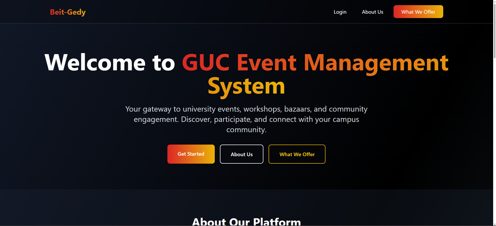
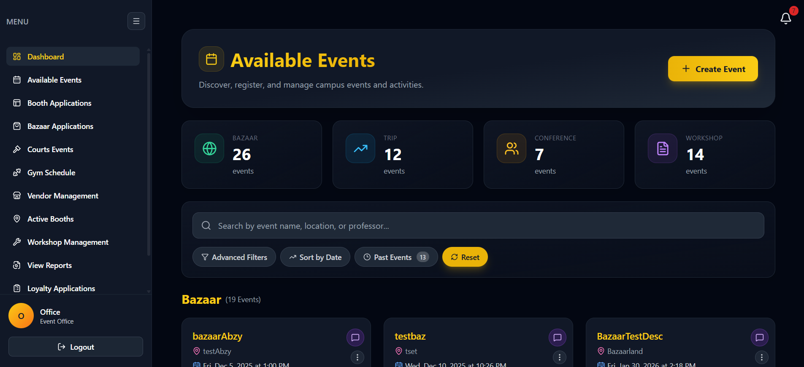
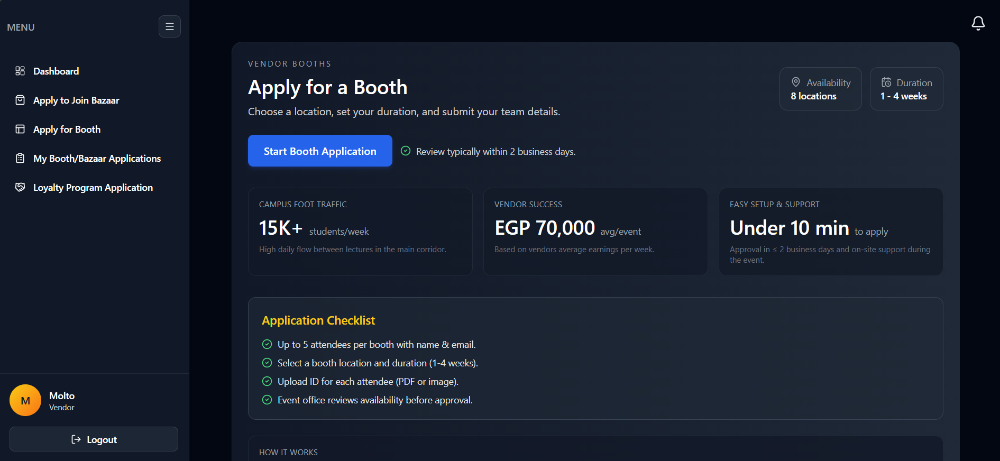
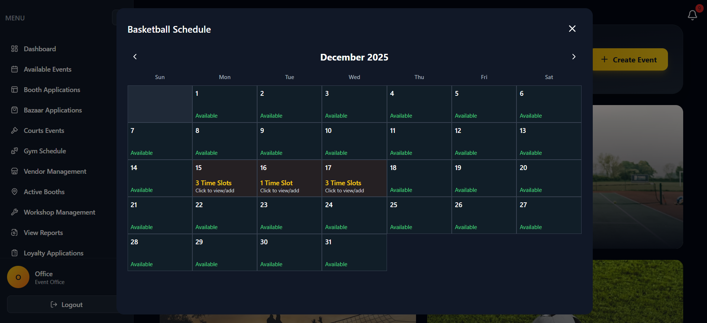
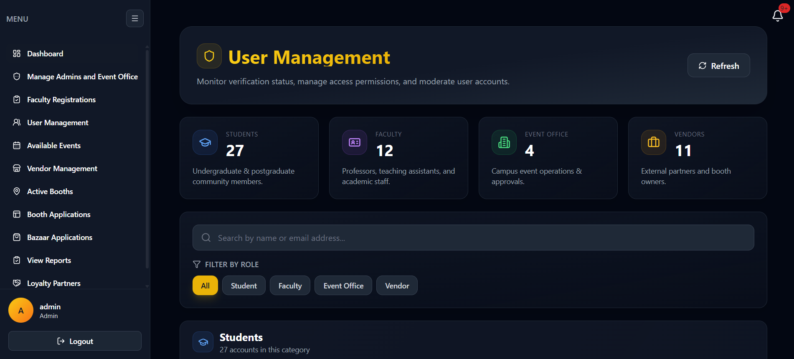
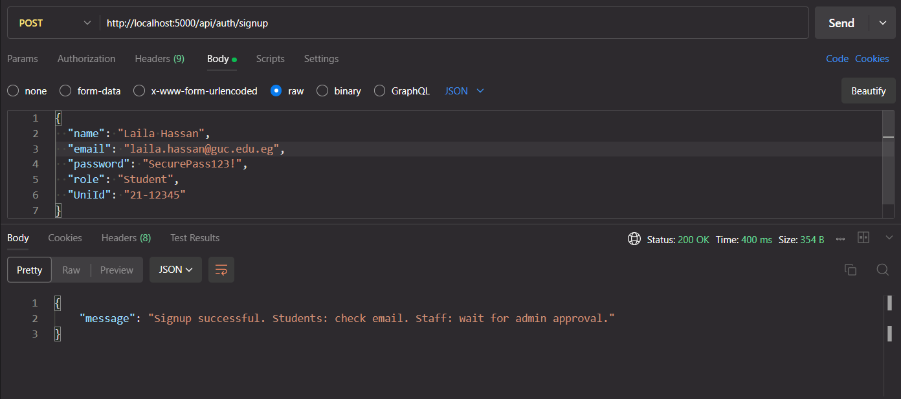
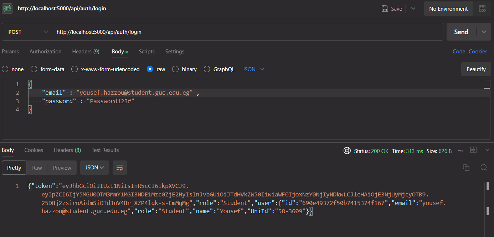
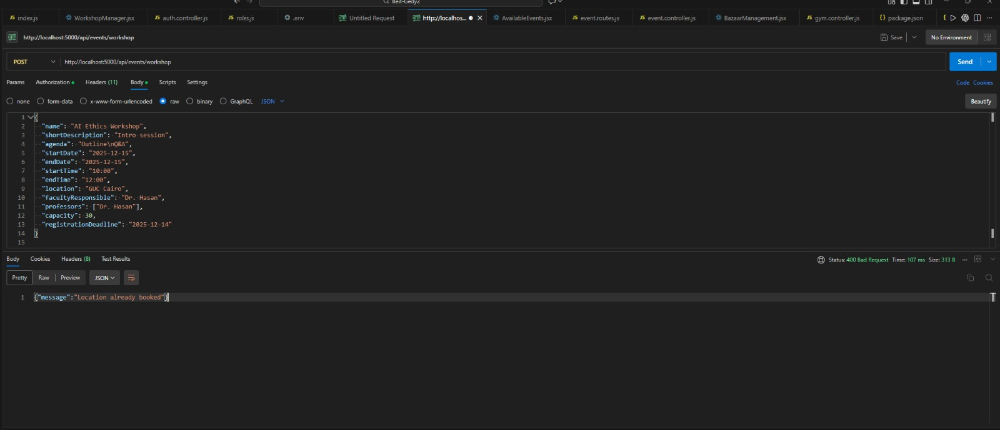
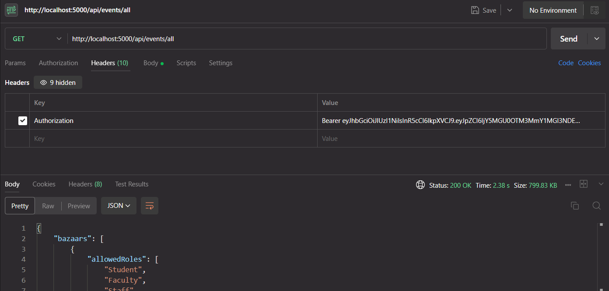
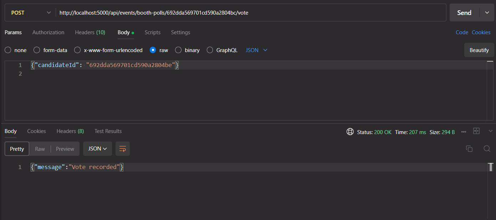

# Campus Engagement & Event Management Platform

## Motivation

Universities run dozens of events every semester, yet students, staff, vendors, and administrators typically juggle fragmented tools—emails, spreadsheets, and ad-hoc forms. This platform centralizes announcement, registration, and vendor operations so all stakeholders see the same source of truth. It exists to reduce repetitive Event Office logistics and to give students a modern experience when browsing activities.

The system serves Event Office coordinators, student clubs, and accredited vendors. Students discover and RSVP to events, faculty manage workshops, vendors submit booth applications, and admins monitor everything from a single dashboard. With integrated loyalty programs, court reservations, and QR check-ins, the application creates transparency and engagement across campus life.

## Build Status

**Sprint 2 Status:** Partially complete / feature-hardening phase.

**Known Issues / Limitations**

- QR dispatch requires at least one paid vendor; unpaid states still display generic messages.
- Court reservation calendar lacks recurring reservations and conflict resolution UI.
- Accessibility (WCAG) pass still pending; modals need better keyboard traps.
- Push notifications queue is volatile (no persistent retry yet).
- Bulk admin actions lack undo support, so mistakes require manual database fixes.

## Code Style

- **Naming:** camelCase for JS variables/functions, PascalCase for React components and Mongoose models, SCREAMING_SNAKE_CASE for env constants.
- **Structure:** Backend under `backend/src/{controllers,models,routes,utils}`; Frontend under `frontend/src/{components,pages,context,lib}` using feature-based grouping.
- **Linters/Formatters:** ESLint (Airbnb-ish rules) + Prettier; Husky hooks enforce `npm run lint` on commit. Tailwind config enforces utility-first styling.

## Screenshots

  
  
  
  


## Tech / Framework Used

- **MERN Stack:** MongoDB, Express.js, React, Node.js
- **UI:** Tailwind CSS, Lucide icons, custom chart widgets
- **State/Auth:** React Context + JWT (HttpOnly cookies)
- **Payments & QR:** Stripe for booth payments, `qrcode` for pass generation
- **Uploads:** Multer for attendee IDs; Cloudinary ready hook
- **Tooling:** Prettier, Nodemon

## Features

- Role-based authentication for students, vendors, faculty, Event Office, and admins
- Event discovery with filters, ratings, and details modals
- Cancellation with UniID validation and wallet refunds
- Vendor bazaar applications, attendee upload, and status tracking
- Loyalty program submissions with terms download support
- Vendor polls/booth voting with secure logging
- Court reservation time slots, confirmation modals, and booked-slot drill downs
- Gym session scheduling + participant management
- Active booths map overlay for on-site visibility
- Admin dashboards for user management, event moderation, and feedback control
- Stripe-backed payments + automated email QR distribution

## Code Examples

```javascript
// backend/src/controllers/auth.controller.js
export const loginAdmin = async (req, res) => {
  const { email, password } = req.body;
  const admin = await Admin.findOne({ email }).select("+password");
  if (!admin || !(await admin.comparePassword(password))) {
    return res.status(401).json({ message: "Invalid credentials" });
  }
  const token = generateJwt(admin._id, "Admin");
  return res.cookie("token", token, cookieOptions).json({ role: "Admin" });
};
```

```javascript
// backend/src/routes/event.routes.js
router.patch(
  "/events/trip/register/:id",
  authGuard(["Student", "Staff", "Professor"]),
  registerToTrip
);
router.post(
  "/events/workshops",
  authGuard(["Admin", "Event Office"]),
  createWorkshop
);
```

```javascript
// backend/src/models/bazaar.model.js
const VendorRequestSchema = new Schema(
  {
    vendor: { type: Schema.Types.ObjectId, ref: "Vendor", required: true },
    boothSize: { type: String, enum: ["2x2", "4x4"], required: true },
    attendees: [{ name: String, email: String }],
    status: {
      type: String,
      enum: [
        "pending",
        "awaiting_payment",
        "accepted",
        "rejected",
        "cancelled",
      ],
      default: "pending",
    },
    paidAt: Date,
  },
  { _id: false }
);
```

```javascript
// frontend/src/components/AvailableEvents.jsx
const computeRegistrationDeadlineDate = (event) => {
  if (!event?.registrationDeadline) return null;
  const deadline = new Date(event.registrationDeadline);
  const start = buildDateTimeFromParts(event.startDate, event.startTime);
  deadline.setHours(23, 59, 0, 0);
  return start && start.toDateString() === deadline.toDateString()
    ? start
    : deadline;
};
```

```javascript
// frontend/src/components/TimeSlotModal.jsx
const confirmReservation = async () => {
  if (!selectedTimes.length) return;
  setReserving(true);
  try {
    await Promise.all(
      selectedTimes.map((time) =>
        api.post("/courts/reserve", {
          court,
          date: selectedDate.toISOString(),
          time,
        })
      )
    );
    toast.success("Court reserved!");
    onReservationSuccess?.();
    onClose();
  } finally {
    setReserving(false);
    setShowConfirmationModal(false);
  }
};
```

## Installation

1. **Prerequisites:** Node.js 18+, npm 9+, MongoDB 6+, Stripe keys if using payments.
2. **Clone repo:** `git clone https://github.com/<org>/Beit-Gedy.git && cd Beit-Gedy`
3. **Backend setup:** `cd backend && npm install`
4. **Frontend setup:** `cd ../frontend && npm install`
5. **Environment vars:**
   - Backend `.env`: `MONGO_URI`, `JWT_SECRET`, `STRIPE_SECRET`, `EMAIL_SMTP`, `CLIENT_URL`
   - Frontend `.env`: `REACT_APP_API_BASE_URL`, `REACT_APP_STRIPE_PUBLISHABLE_KEY`
6. **Run backend:** `cd backend && npm run dev`
7. **Run frontend:** `cd frontend && npm run dev`
8. Access app via `http://localhost:5173`

## API References

| Method | Route                        | Description                                            | Params/Body                          |
| ------ | ---------------------------- | ------------------------------------------------------ | ------------------------------------ |
| POST   | `/auth/login`                | Authenticate user                                      | `{ email, password }`                |
| GET    | `/events/all`                | Fetch all events (workshops/trips/bazaars/conferences) | Optional `type` filter               |
| PATCH  | `/events/trip/register/:id`  | Register student/faculty                               | `{ email, UniId }`                   |
| POST   | `/bazaars/:id/apply`         | Submit bazaar application                              | FormData with booth size & attendees |
| POST   | `/courts/reserve`            | Reserve court slot                                     | `{ court, date, time }`              |
| GET    | `/loyalty/vendor/:vendorId`  | Fetch loyalty submissions                              | Path param `vendorId`                |
| PATCH  | `/events/workshops/:id/edit` | Event Office edits workshop                            | JSON payload                         |

## Tests

- **Postman – Register User:** Validates `/auth/register` returns 200 + token.  
  
- **Postman – Login:** Ensures `/auth/login` accepts credentials with 200.  
  
- **Postman – Create Workshop:** Sends payload to `/events/workshop`, expects location already booked.  
  
- **Postman – Get Events:** Calls `/events/all` verifying grouped response.  
  
- **Postman – Vendor Poll Vote:** Posts to `/events/booth-polls/:pollId/vote`, confirms unique vote per user.  
  

## Contribute

1. Fork the repo and create a feature branch (`git checkout -b feature/amazing`).
2. Follow code style (Prettier) and write descriptive commits.
3. Add tests or Postman evidence for new endpoints.
4. Open a pull request explaining the change, linking issues if applicable.
5. Be respectful in reviews—this is a university collaboration.

## Credits

- **Core Team:** Hasan Khaled, Yousef Hazzou, Abdlerahman Magdy, Yassin Atta, Moataz Hegazi, Metwalli Nabil, Youssef Bassem, Mohamed El-Sayed Kosba, Omar Osama, Aly Ahmed
- **Resources:** MDN Web Docs, React and Express official docs, Stack Overflow, Traversy Media tutorials.

## License

Released under the **MIT License**; see LICENSE file for details. Integrations (Stripe SDK under Apache 2.0, Lucide icons under MIT) must follow their respective licenses. Reuse and contributions welcome under the same terms.
